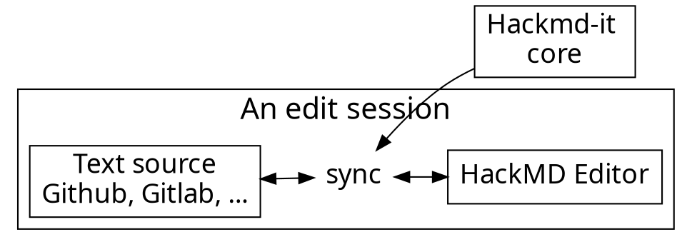

# Art antérieur

- https://www.ganatan.com/tutorials/demarrer-avec-angular

---

# Moyens pédagogiques

- KataCoda
- [stackblitz.com](https://stackblitz.com/angular/onppypbvepy)
- http://www.typescriptlang.org/play/
- https://jsonplaceholder.typicode.com/photos

---

# Plan de la formation

- On plonge !
  - `ng serve`, et un IDE qui type-checke TypeScript, Chrome, [Augury](https://chrome.google.com/webstore/detail/augury/elgalmkoelokbchhkhacckoklkejnhcd?hl=en)
    - 💡 `ng create` : pourquoi pas, mais toujours relire le diff
  - Une app “hello world” avec un module et un component (pas d'explications pour l'instant)
  - Les trucs utiles
    - this.console = console, this.alert = window.alert etc.
     - <pre>{{ products | async | json }}</pre>
  - Démo d'une directive ("appHighlight", tiré de la doc) avec exercices
    - Comment en faire "app-highlight" ?
  - Explications
    - TypeScript ; décorateurs, constructeurs magiques à la C++
    - Dependency injection (sur ElementRef) : le hollywood principle, appliqué aux constructeurs et à leurs paramètres
    - `this.el.nativeElement.style.backgroundColor` #kesako
    - Un `Component` est juste une `Directive` avec un template
      - Pain point : le langage de templates
        - [appMyBinding]='jsExpr'    # Ceci est une entrée
        - (click) = 'doSomehing()'   # Ceci est une sortie
        - [(ngModel)]                # Two-way data binding

- Généralités   (à mijoter / réduire)
  - Historique d'Angular, positionnement, success stories
    - Angular a bien changé...
      - Exit les variables $, sauf cas particuliers (`$event` dans un `(keyup)=`)
    - Paradigmes et shiftes
      - Comme tout le monde :
        - personnalisation des tags
        - Web widgets ([encore que]())
      - Comme tout le monde, mais mauvaise idée
        - `ng create` — Mieux vaut savoir ce qu'il fait réellement (notamment dans le `@NgModule`); `git diff` est votre ami
      - Spécifique à Angular
        - ~~zero~~ low-code platform, grâce à TypeScript
        - Dependency injection
        - Interprétation des templates sur le client (vs. "AoT", Ahead of Time, qui est une optimisation de prod', et qui pour faire court, ne marche pas)
        - Interdiction d'accès à `window`
  - «Pourquoi Angular est-il mieux que...» → Quels problèmes Angular essaye-t'il de résoudre ?
    [ Image de la courbe économique : https://en.wikipedia.org/wiki/Pareto_efficiency#/media/File:Front_pareto.svg ]
    - Attaque du problème du dataflow (⇒ mieux que jQuery)
    - Intégration «transparente» dans une application Web (⇒ mieux que Meteor)
    - Projets de grande taille (⇒ mieux que Vue.js)
      - Plusieurs approches pour l'architecture des données
      - Plusieurs étages de modularité (components et modules) ⇒ «mieux» que React
      - Travail à plusieurs : conventions de style, types (TypeScript), IDE
    - Détection des changements : [l'approche brutale](https://teropa.info/blog/2015/03/02/change-and-its-detection-in-javascript-frameworks.html#angularjs-dirty-checking)
    - Angular pour mobile (⇒ mieux que Vue)
      - Plug ! Ionic est à Meteor comme Cordova est à TypeScript
  - Les faiblesses
    - Codé à la Java — zones.js est vendu comme un «thread-local storage pour JS»
    - Modèle de redessin difficile à raisonner
      - Les Trois Pannes : `ExpressionChangedAfterItHasBeenCheckedError`, boucle de recalcul, données affichées obsolètes
      
- On continue ! Le menu 
  - NavRouter ⇒ où l'on découvre à quoi sert le `imports` du @NgModule
  - Bootstrap et `NgbModule`
  - Injectons quelque chose ! I18N { getLanguage(), setLanguage() } ⇒ où l'on découvre à quoi sert `providers`
  
- TODO Ici un § théorique à choix

- TODO Présenter : HostBinding, HostListener, ng-class, etc.

- Rendre l'app utile : XHR, sécurité
  - On commence fort : un typeahead («Vous avez aimé les Promises ? Vous allez adorer les Observables !»)
  - Pour protéger vos écritures : pensez framework
    - REST ⇒ penser à l'authentification
    
- Test first, at last
  - [?] https://storybook.js.org/

Outillage et pré-requis
  -  — Débogueur pour Chrome
  - [tslint](https://palantir.github.io/tslint/), une belle usine à gaz
    - Impossible de lui faire émettre des infos de *type* — Recommander une alternative
Mise en route / sujets simples
  - Mise en place à l'intérieur d'une application
  - npm, peer dependencies
    - `npm install -g` ? `npx` !
  - Les bases de JS et TypeScript
    - JavaScript moderne : promesses (yeah!), classes (bleeargh)
      - moins besoin de lodash, mais quand même
    - `@types`, `tsconfig.json`, oh my — https://medium.com/@KevinBGreene/surviving-the-typescript-ecosystem-working-with-types-and-type-definitions-3539baf26627
    - Exercice : convertir un fichier .js en .ts (GUI adapté à fournir)
  - Un composant simple (dans un `@NgModule`)
    - Vocabulaire : vue (*template*), contrôleur
    - Exploration avec Augury
      - Surprise : l'élément cible du templating n'est **pas** remplacé ! «Il n'y a jamais trop de &lt;div&gt;» (Abraham Lincoln, 1851)
    - Passage de paramètres : @Input() et <foo [field]>
      - Mnémonique : [ce qui rentre], (ce qui sort)
  - Le cycle de développement
    - polyfills.ts : ne sont pas des polyfills... Plutôt des fragments de run-time
      - Angular semble fournir une aide guère plus que minimaliste
        pour la «compilation conditionnelle» de ce run-time
      - Probablement une source de tirage de cheveux en fin de projet (optimisation)
    - Compilation, release
  - Routeur et single-page Web app
    - ⚠ Un composant doit savoir s'il est «routé» ou appelé par un template ! https://github.com/angular/angular/issues/18967

Sujets avancés
  - Test first!
  - Performance troubleshooting : profiler le re-rendu
    https://stackoverflow.com/questions/40850766/debug-angular2-change-detector
  - Mobile first, SASS, ARIA, intégration charte graphique
  - Ionic

# Feuille de route

pour l'autonomie...

1. Un cycle de développement qui vous soutient
   - Zéro warnings dans la console du navigateur
   - Savoir comment revenir à l'état qui marche avec git
   - Les bons outils pour aller de l'avant
   - Une *definition of done*
1. Une approche utile de la documentation
   - Angular → Angular 2 → ... Angular
   - Mais certains articles etc. concernant Angular 2 sont toujours d'actualité !
     ⇒ **observer la date**. Date < 2019 ⇒ passez votre chemin.
     


# Unleash the power!

<!-- Put the link to this slide here so people can follow -->
slide: https://hackmd.io/p/template-Talk-slide

---

We have a collaborative session

please prepare laptop or smartphone to join!

---

## Who am I?

- Front-end developer
- VSCode :heart: 
- I use tabs. :cat: 

---

### 70% of our users are developers. Developers :heart: GitHub.

---



---

### Usage flow

---




---

### Architecture of extension

---


---

## Content script

- Bind with each page
- Manipulate DOM
- Add event listeners
- Isolated JavaScript environment
  - It doesn't break things

---

# :fork_and_knife: 

---

<style>
code.blue {
  color: #337AB7 !important;
}
code.orange {
  color: #F7A004 !important;
}
</style>

- <code class="orange">onMessage('event')</code>: Register event listener
- <code class="blue">sendMessage('event')</code>: Trigger event

---

# :bulb: 

---

- Dead simple API
- Only cares about application logic

---

```typescript
import * as Channeru from 'channeru'

// setup channel in different page environment, once
const channel = Channeru.create()
```

---

```typescript
// in background script
const fakeLogin = async () => true

channel.answer('isLogin', async () => {
  return await fakeLogin()
})
```

<br>

```typescript
// in inject script
const isLogin = await channel.callBackground('isLogin')
console.log(isLogin) //-> true
```

---

# :100: :muscle: :tada:

---

### Wrap up

- Cross envornment commnication
- A small library to solve messaging pain
- TypeScript Rocks :tada: 

---

### Thank you! :sheep: 

You can find me on

- GitHub
- Twitter
- or email me


<!-- 
  This style apply by default to all slides, unless .slide is used. 
  Note the use of the reveal class selector: this mean that only the presentation is affected by this style, and the makrdown preview or the book mode of hackmd.io is style intact.
  If you want/need a resizable background image, add the background-size: cover; property and change background-position: 0px 0px; 
-->
<style>
  .reveal {
    background-color: #fff;
    background-image: url('https://epfl-idevelop.github.io/elements/svg/epfl-logo.svg');
    background-repeat: no-repeat;
    background-position: 5px 5px;
  }
  .reveal {
    color: #707070;
  }
  .reveal h1, .reveal h2, .reveal h3, 
  .reveal h4, .reveal h5, .reveal h6 {
    color: #212121;
  }
  .reveal a {
    color: #f009;
  }
  .reveal a:hover {
    color: #f00;
  }
  .reveal code {
    padding-top: 0.2em;
    padding-bottom: 0.2em;
    margin: 0;
    font-size: 85%;
    background-color: rgba(255, 255, 255, 0.46);
    border-radius: 3px;
  }
  [data-contrast="on"] > div { 
    background-color: #ffffff94; 
  }
  /* https://stackoverflow.com/a/39614958/960623 */
  img[alt$=">"] {
    float: right;
  }

  img[alt$="<"] {
    float: left;
  }

  img[alt$="><"] {
    display: block;
    max-width: 100%;
    height: auto;
    margin: auto;
    float: none!important;
  }
</style>
